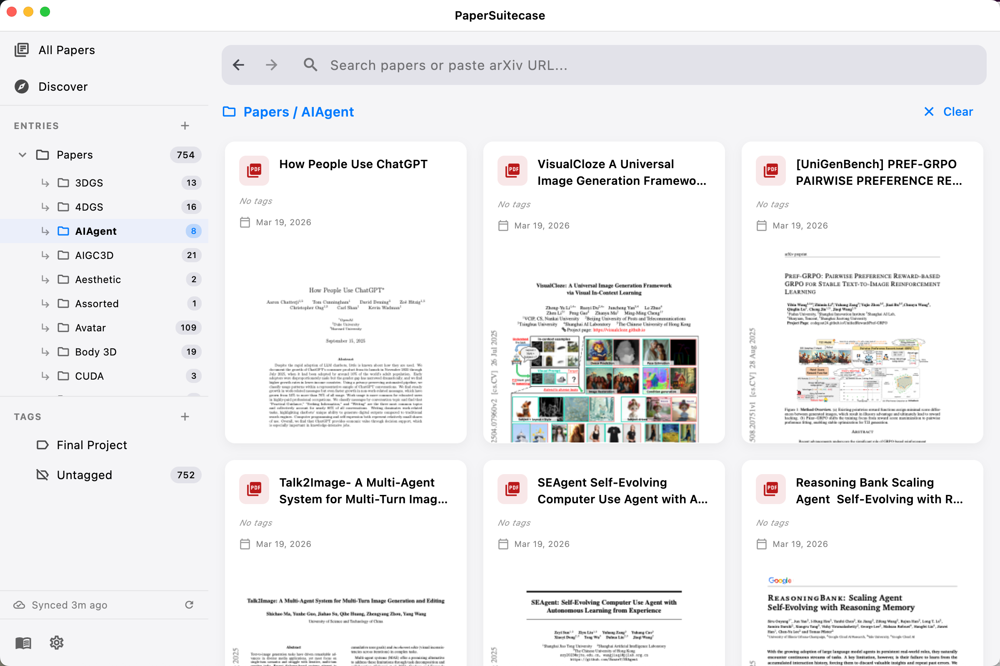
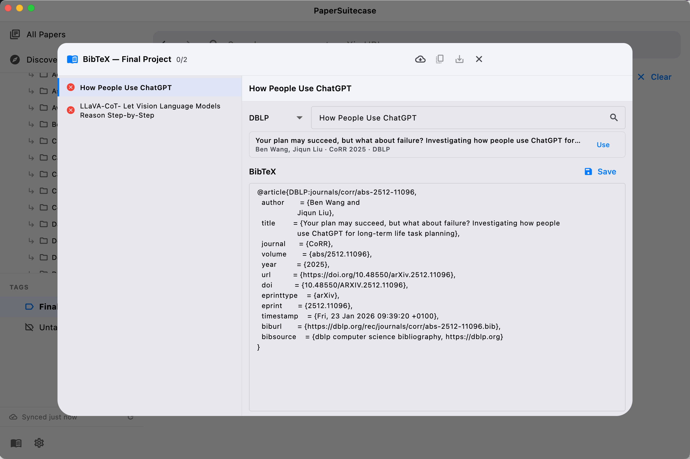

# Paper Suitecase

A desktop app for managing academic PDF papers with hierarchical tagging, arXiv integration, and BibTeX export.

  

## Features

- **Link folders as entries** — reference existing directories without copying files; works with OneDrive, Dropbox, Nutstore, Google Drive
- **arXiv download** — paste an arXiv URL to fetch the PDF with auto-extracted metadata and duplicate detection
- **Hierarchical tags** — organize papers by project, topic, or reading group
- **BibTeX management** — look up references from DBLP, generate and export BibTeX for Overleaf/LaTeX
- **Full-text search** — FTS5-powered search across titles, authors, abstracts, and extracted text
- **Auto-scan** — detects new, removed, and renamed PDFs in your linked folders on launch

## Screenshots

| Main View | arXiv Download | BibTeX Export |
|:-:|:-:|:-:|
|  |  |  |

## Getting Started

Download the latest release from the [Releases](https://github.com/initialneil/papersuitecase/releases) page.

**Requirements:** macOS 12+

## Website

[initialneil.github.io/papersuitecase](https://initialneil.github.io/papersuitecase)
